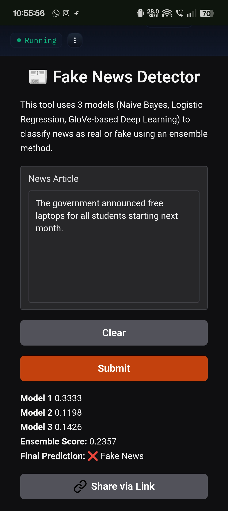

# Fake News Detection using AI

## 📌 Project Overview
This project detects whether a news article is real or fake using Artificial Intelligence.

## 🧠 Technologies Used
- Machine Learning
- Deep Learning
- Natural Language Processing (NLP)

## 🛠 Tool Used
- Hugging Face Spaces

## ⚙️ How It Works
The system uses an ensemble of three models:
- Naive Bayes
- Logistic Regression
- Deep Learning (GloVe)

The user enters a news article, and the AI predicts whether it is real or fake.

## 🌍 Social Impact
This project helps prevent the spread of misinformation and fake news on social media.

## 🔗 Live Demo
https://jainilp30-fake-news-detector.hf.space/?__theme=system&deep_link=wiW2gbVr3rw

## 📸 Output
### Screenshot 1: News Input

### Screenshot 2: Prediction Result

